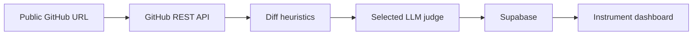

# Preflight

**Commit assurance for AI-assisted code.**

Preflight inspects recent commits in a public GitHub repository, applies deterministic diff checks, and asks a selected LLM to return an explained `Clear`, `Review`, or `Hold` verdict. The result is a flight-instrument dashboard that lets a developer see what changed, why it was flagged, and how much of a repository's recent history they can trust at a glance.

Built for the ChatGPT Codex India Hackathon 2026, Theme 5: Building Evals.

## What It Does

- Ingests the most recent 20 commits and diffs from a public GitHub repository through the GitHub REST API.
- Runs a reference-check heuristic for unresolved-looking identifiers in added code.
- Flags coverage deltas when source changes land without matching test changes.
- Uses an LLM judge to compare the commit message, diff, and heuristic results, returning structured JSON with a verdict and a concise rationale.
- Persists completed analyses to Supabase as each commit finishes and streams them to the dashboard progressively.
- Lets the operator select a configured provider and one of its available models before analysis.

## Analysis Flow



The pipeline deliberately runs at a concurrency of two and caps a request at 20 commits. Completed analyses are persisted and sent to the UI immediately; the user does not wait for the whole batch to finish.

## LLM Providers

The dashboard only lists providers whose server-side key is configured. It then fetches that provider's available models into the model dropdown.

| Provider | Environment variable |
| --- | --- |
| OpenAI | `OPENAI_API_KEY` |
| Google Gemini | `GEMINI_API_KEY` |
| xAI Grok | `XAI_API_KEY` |
| NVIDIA NIM | `NVIDIA_NIM_API_KEY` |
| OpenRouter | `OPENROUTER_API_KEY` |

NVIDIA NIM uses `https://integrate.api.nvidia.com/v1` by default. Set `NVIDIA_NIM_BASE_URL` only when using a self-hosted NIM endpoint.

## Local Setup

### 1. Install dependencies

```bash
npm install
```

### 2. Create the Supabase schema

Open the Supabase SQL Editor for your project and run [supabase/migrations/20260728000000_initial_schema.sql](supabase/migrations/20260728000000_initial_schema.sql).

### 3. Configure local secrets

Copy `.env.example` to `.env.local` and fill in only the providers you intend to offer:

```bash
NEXT_PUBLIC_SUPABASE_URL=https://your-project.supabase.co
SUPABASE_SERVICE_ROLE_KEY=your-supabase-service-role-key

GEMINI_API_KEY=your-gemini-api-key
NVIDIA_NIM_API_KEY=your-nvidia-nim-api-key
```

`SUPABASE_SERVICE_ROLE_KEY` and every LLM key are server-only secrets. Do not add a `NEXT_PUBLIC_` prefix to them.

### 4. Run the app

```bash
npm run dev
```

Open `http://localhost:3000`, paste a public GitHub repository URL, choose a configured provider and model, and start the analysis.

## Deploy To Vercel

1. Push this repository to GitHub.
2. Import it as a Next.js project in Vercel.
3. In **Project Settings -> Environment Variables**, add the following for the deployment environments you need:

   ```text
   NEXT_PUBLIC_SUPABASE_URL
   SUPABASE_SERVICE_ROLE_KEY
   GEMINI_API_KEY
   NVIDIA_NIM_API_KEY
   ```

   Add other provider keys only when you want them to appear in the dashboard. Do not put any secret in a `NEXT_PUBLIC_` variable.
4. Deploy. After adding or changing environment variables, redeploy so the Function receives them.
5. Confirm that the configured providers appear in the dropdown, select a model, and analyze a small public repository first.

Vercel runs the API routes on the Node.js runtime. The repository-analysis route streams progress with Server-Sent Events while results are stored in Supabase.

## Security

- `.env*` is ignored by Git, while `.env.example` is committed with placeholders only.
- Local Vercel metadata and common private-key formats are also ignored.
- Supabase and LLM calls run only in server-side route handlers or server-only modules.
- The client receives analysis data and provider/model labels, never provider credentials.
- If a credential is ever pasted into a tracked file, revoke and rotate it in the provider dashboard before deploying.

## API Surface

| Route | Purpose |
| --- | --- |
| `POST /api/repos` | Start progressive analysis for a public repository. |
| `GET /api/repos/:id/commits` | Fetch the timeline for a stored repository. |
| `GET /api/commits/:id` | Fetch a commit detail and current diff. |
| `GET /api/llm/providers` | List configured providers without exposing keys. |
| `GET /api/llm/providers/:provider/models` | List models for a configured provider. |

## Verification

```bash
npm test
npm run lint
npm run build
```

## Intentional MVP Boundaries

Preflight does not execute untrusted repository test suites, subscribe to GitHub webhooks, support private repositories, or provide multi-repo accounts and billing. Those are deliberate Phase 2 decisions; the MVP focuses on fast, explained pre-merge confidence for public GitHub histories.
